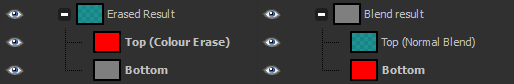
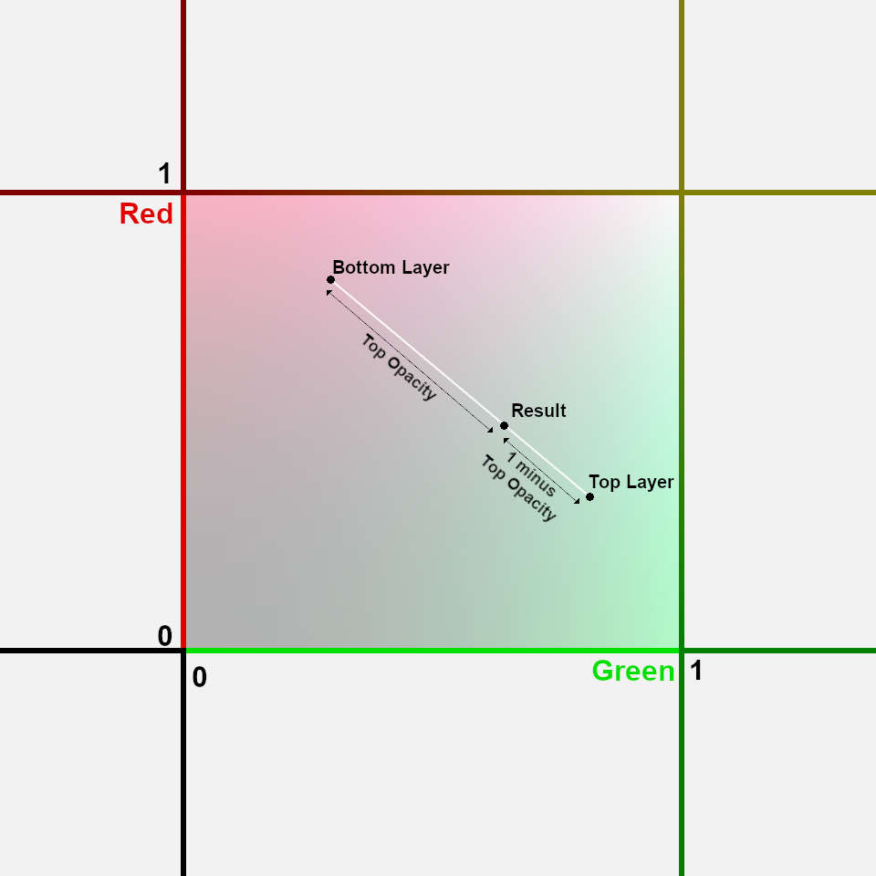
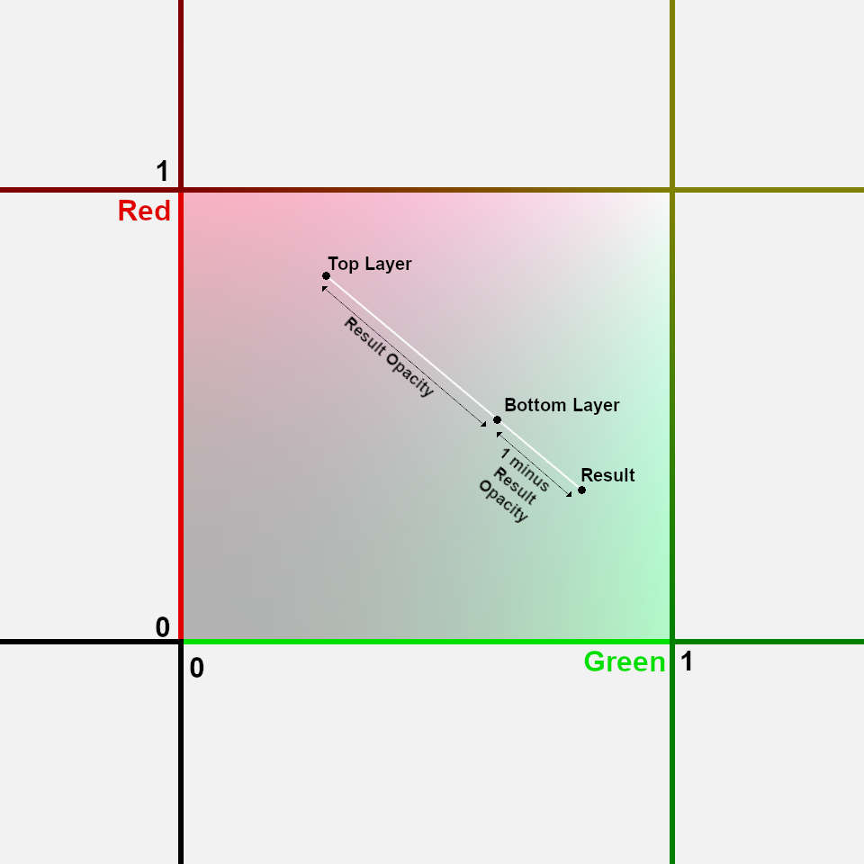
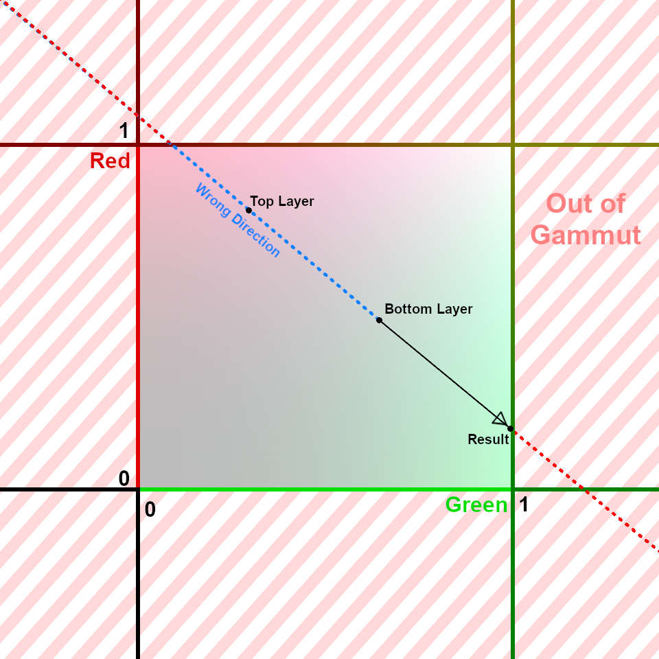
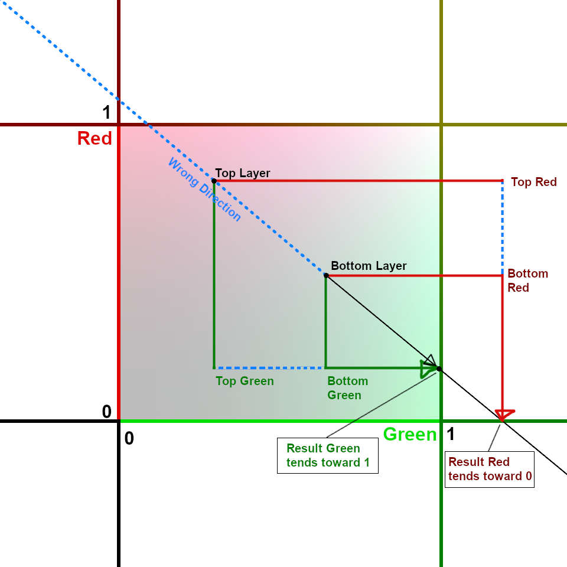

# Colour to Alpha: a study

This is a study of Gimp's Colour Erase blend mode. Here, I try to figure out the math behind it filter based on observations of its behaviour.

The *Colour to Alpha* filter and *Colour Erase* blend mode work in similar ways, but take slightly different parameters: the filter has alpha threshold options, while the blend mode can take a semi-transparent coulours as its input. This specifically a study of the **blend mode**.

> Throughout this document `lerp` and `remap` are defined as:  
> `lerp(a,b,t) = a*(1-t) + b*t`  
> `remap(iMin,iMax,oMin,oMax,n) = oMin + (oMax-oMin)*(n-iMin)/(iMax-iMin)`

## 1. What are we looking for ?
### The basics

In broad strokes, Colour Erase is the inverse operation of the Normal Blend mode: If you erase a colour from a (fully opaque) layer, then back-fill it with the same colour, the resulting layer will be identical to the one you started with:


<figure>
	
	<figcaption>Same colours, different arrangements.</figcaption>
</figure>

This equality remains true so long as: 1. The bottom layer is fully opaque in both cases, and 2. the Top layer in "erase" mode is also fully opaque. (I.e, all layers with bold names in the screenshot are fully opaque.)

We will start by figuring out how this specific case work, since we have a well defined behaviour for it. We'll work out later how different top and bottom opacities behave.

Here, Normal blend is simply a Linear Interpolation between the two layers:  
`result[rgb] = lerp(bottom[rgb], top[rgb], topOpacity)`.


<figure>
	
</figure>

> For visual clarity, only 2 RGB channels are pictured. The mathematical process for 2 channels is exactly the same as with 3 channels.

With colour erase, those colours simply change name: What was previously the Top colour becomes the Result, the Result becomes the Bottom, and the Bottom becomes the Top:

<figure>
	
	<figcaption>Same colours, different names.</figcaption>
</figure>

Since normal blend is a linear interpolation, then what we have here is simply a linear *extrapolation*:  
`result[rgb] = lerp(top[rgb], bottom[rgb], 1/resultOpacity)`

Additionally, the result's opacity is proportional to the distances between the points, so we can get it by remapping their coordinates:  
`resultOpacity = remap(top[rgb],result[rgb], 0,1, bottom[rgb])`  

For all of these equations, the name `rgb` can refer to any single colour channel, used in complete isolation from the others.


### Limitations and unknowns

We have these two equations:  
`result[rgb] = lerp(top[rgb], bottom[rgb], 1/resultOpacity)`  
`resultOpacity = remap(top[rgb],result[rgb], 0,1, bottom[rgb])`  

The first apparent problem is that the two unknowns we're trying to compute, `result[rgb]` and `resultOpacity`, are dependent on each other. Many combinations of these would give us valid answers, so there is no unique solution to these equations:

<figure>
	
	<figcaption>All colours on this line are mathematically correct answers to our equations.</figcaption>
</figure>

We need to better define _which_ point we are looking for.

On this line, colours closer to Bottom will have less of the top colour erased. Because Top has 100% opacity, we expect our filter to erase as much colour as possible, thus **Result must be as far way from Bottom as possible.**  We still want our result to be within gammut, so the farthest we can go is **where the line intersects with the unit cube**.

Our previous understanding of Result's opacity was based on Bottom standing *in-between* Top and Result. Any other arrangement would result in an opacity outside of the range 0%-100%. Thus we can exclude an entire half of the line: **Result must stand on the side of Bottom opposite to Top.**

<figure>
	
	<figcaption>Solutions on the red part of the line have Out-of-Gammut RGB. Solutions on the blue part of the line have invalid Alpha.</figcaption>
</figure>

This Result corresponds to a Top opacity of 100%. Different opacities will result in different points on the black segment of this line, getting closer to Bottom as Top opacity tends toward 0%. We can obtain them simply by linearly interpolating between Bottom and Result.

## 2. How do we calculate that ?
Our equations are still:  
`result[rgb] = lerp(top[rgb], bottom[rgb], 1/resultOpacity)`  
`resultOpacity = remap(top[rgb],result[rgb], 0,1, bottom[rgb])`  

The `resultOpacity` is still a complete unknown, but `result[rgb]` has been partially solved: **Because the result lies on the surface of the unit cube, at least one of its coordinates is guaranteed be equal to either 0 or 1 !** From this single coordinate, we can calculate the result's opacity, from which we can calculate the other two missing coordinates.

Now, we just need to figure out which channel is the most extreme, and which extreme it is.
We've previously established that "results is on the side of bottom opposite to top", this also applies to each axis individually, so we know which extreme each of the resulting channels tends toward:

<figure>
	
	<figcaption>Possible solutions based on each colour channel. Again, only two solutions out of three are represented here, due to Blue being omitted.</figcaption>
</figure>

From these three possible coordinate, **we can compute three candidates for the resulting opacity,** each, corresponding to a different intersection of the line with one of the unit planes.

Only one of these points is guaranteed to be on the unit cube; the bad ones will be out of gammut, farther away from Bottom than our intended solution, and thus yield lower opacities. Therefore, **the correct opacity is the greatest of the three.**

```cpp
double result[] = new double[4];
result[ALPHA] = 0;

for (int rgb=0; rgb<3; ++rgb) // For each color channel,
{
	// Find which extreme the result tends toward,
	double candidateRgb;
	if (bottom[rgb] < top[rgb])
		candidateRgb = 0
	else
		candidateRgb = 1;

	// Compute the alpha for this extreme
	double candidateAlpha = remap(top[rgb],candidateRgb, 0,1, bottom[rgb]);

	// Keep the candidate with highest alpha.
	result[ALPHA] = max(result[ALPHA], candidateAlpha);
}

// Finally, compute the complete RGB from the Alpha we found.
for (int rgb=0; rgb<3; ++rgb)
	result[rgb] = lerp(top[rgb], bottom[rgb], 1/result[ALPHA]);
```

> This is a simplified code, only meant to illustrate the mathematical process. It is not yet protected against edge cases.

## 3. Handling input opacity

So far, what we've computed assumed both a top and bottom layer opacity of 100%. Their effect is pretty minimal:

Bottom's opacity has no effect on the output's RGB, it only reduces the output's Alpha. This only needs be applied as the very last step; all prior operations can completely ignore Bottom's opacity.

Reducing Top's opacity simply brings the Result closer to Bottom, both RGB and Alpha.
At this point, Result's RGB is still directly tied to its Alpha, so we only need to apply top's opacity to the alpha, the effect will naturally cascade down to the RGB when it is computed afterward.

```cpp
// Apply top opacity to the alpha before  blending the RGB. At this point we can
// still treat bottom  as having  100% opacity, so the result  tends toward 1 as
// top tends toward 0.
result[ALPHA] = lerp(1, result[ALPHA], top[ALPHA]);

// Blend RGB using the modified Alpha
for (int rgb=0; rgb<3; ++rgb)
	result[rgb] = lerp(top[rgb], bottom[rgb], 1/result[ALPHA]);

// Apply bottom opacity last.
result[ALPHA] *= bottom[ALPHA];
```

## 4. Edge cases and code-safety
### Divisions by zero
This code has two divisions that need to be protected, one inside the `remap` function, the other in the parameters of `lerp`.


#### a. lerp
We have `result[rgb] = lerp(top[rgb], bottom[rgb], 1/result[ALPHA])`. The offending divisor is `result[ALPHA]`.

When the result opacity is 0%, the expected result is obviously a fully transparent colour. But what _would_ the RGB values of a transparent colour be ? In the end, it doesn't matter, so anything could be considered valid. Gimp's behaviour in this situation is to output the same RGB as the input:

```cpp
if (result[ALPHA] != 0)
	result[rgb] = lerp(top[rgb], bottom[rgb], 1/result[ALPHA]);
else
	result[rgb] = bottom[rgb];
```

#### b. remap
We have:
```
candidateAlpha = remap(top,result, 0,1, bottom)
               = 0 + (1-0)*(bottom-top)/(result-top)
```

The offending divisor is `(result - top)`, which will be 0 when `top` and `result` are equal. Because `bottom` should stand in-between, this is only possible if all three are equal. (Or if `bottom` is out of gammut, but I don't know the expected behaviour for that, so I'll just fall back to the former case.)

When `top` and `bottom` are equal, the expected behaviour is, again, for the result to be fully transparent (`candidateAlpha` = 0). Because we already initialized `result[ALPHA]` at 0 at the very beginning, we can just completely skip the computation with no fallback when this happens:

```cpp
if (top[i] != candidateRgb){
	double candidateAlpha = remap(top[i],candidateRgb, 0,1, bottom[i]);
	result[ALPHA] = max(result[ALPHA], candidateAlpha);
}
```

[See final code](./ColourErase.cpp)
